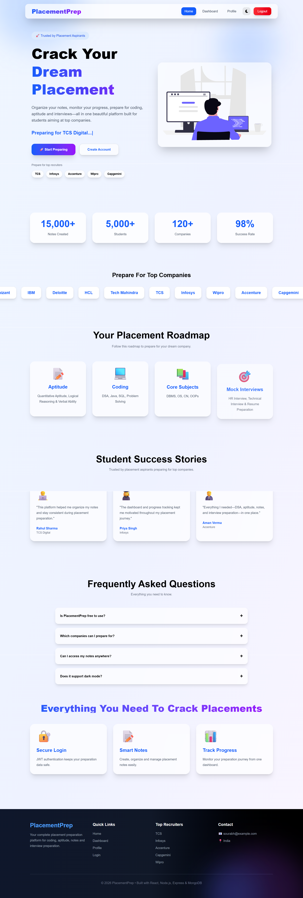
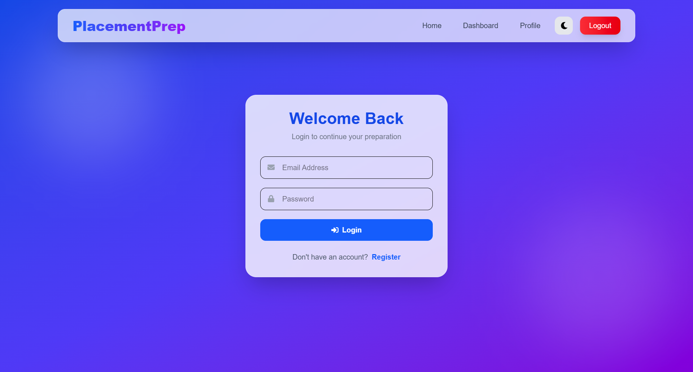
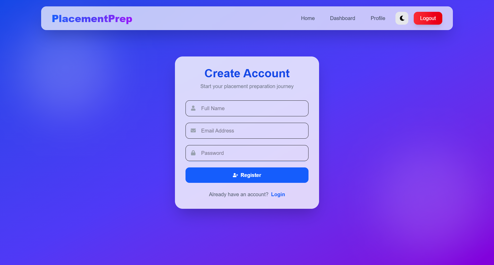
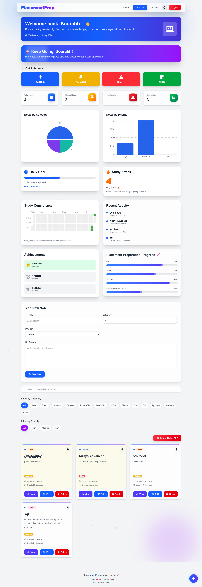
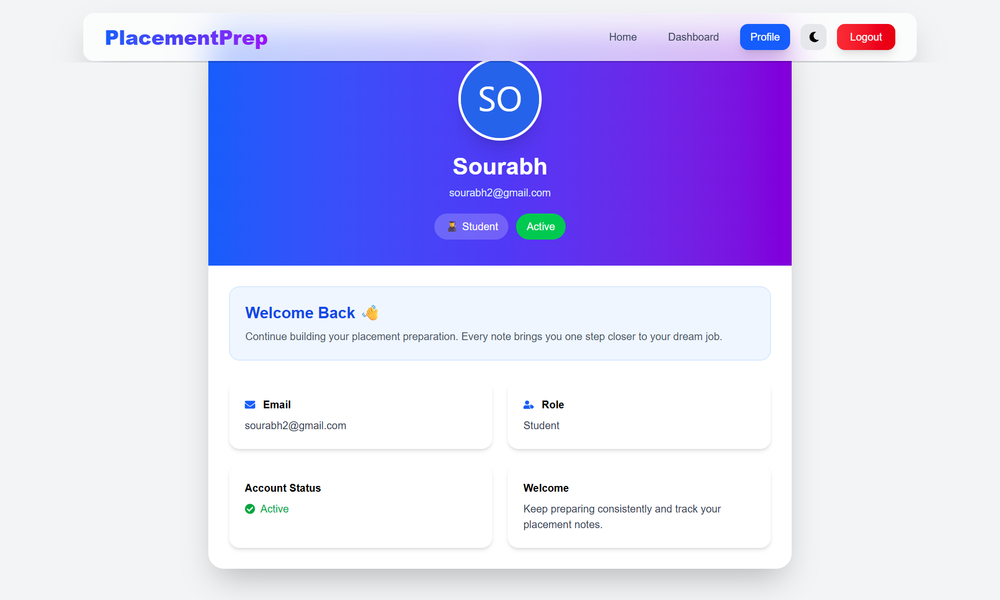
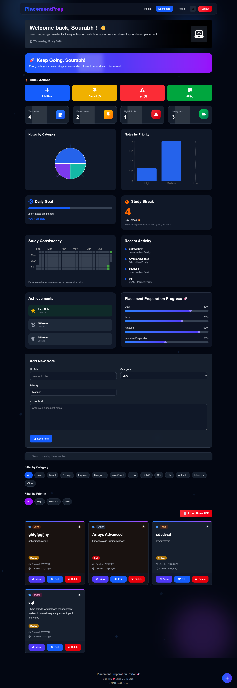

# 🚀 Placement Preparation Portal

A modern full-stack MERN application that helps students organize and track their placement preparation journey.

---

## 📌 Overview

Placement Preparation Portal is designed to help students manage interview preparation in one place. It provides secure authentication, note management, analytics, and progress tracking with a clean and responsive UI.

---

## ✨ Features

- 🔐 JWT Authentication
- 👤 User Registration & Login
- 📝 Create, Update & Delete Notes
- 📂 Organize Notes by Category
- ⭐ Priority-based Notes
- 🔍 Search & Filter Notes
- 📊 Analytics Dashboard
- 📈 Preparation Progress Tracking
- 🌙 Dark Mode Support
- 📱 Fully Responsive Design

---

## 🛠 Tech Stack

### Frontend

- React.js
- Vite
- Tailwind CSS
- React Router
- Axios
- Framer Motion

### Backend

- Node.js
- Express.js
- MongoDB Atlas
- Mongoose
- JWT Authentication
- bcrypt.js

---

## 📂 Project Structure

```text
placement-preparation-portal
│
├── backend
│   ├── config
│   ├── controllers
│   ├── middleware
│   ├── models
│   ├── routes
│   └── server.js
│
├── frontend
│   ├── public
│   ├── src
│   └── package.json
│
├── docs
└── README.md
```

---

# 📸 Screenshots

## 🏠 Home Page



---

## 🔐 Login Page



---

## 📝 Register Page



---

## 📊 Dashboard



---

## 👤 Profile



---

## 🌙 Dark Mode



---

## ⚙️ Installation

### Clone the repository

```bash
git clone https://github.com/sourabhhkumar18/placement-preparation-portal.git
```

### Backend

```bash
cd backend
npm install
npm start
```

### Frontend

```bash
cd frontend
npm install
npm run dev
```

---

## 🚀 Future Improvements

- AI Study Assistant
- Coding Progress Tracker
- Mock Interview Module
- Company-wise Preparation Roadmaps
- Email Notifications
- Calendar Integration

---

## 👨‍💻 Author

**Sourabh Kumar**

GitHub:
https://github.com/sourabhhkumar18

---

## ⭐ Support

If you like this project, consider giving it a ⭐ on GitHub.